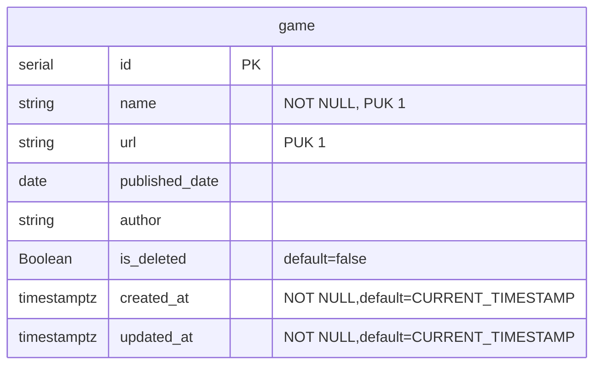

# **Simple Viral Games**

Simple crud app for games.

### Local Setup
1. Clone the repository
2. Run `npm install`
3. Run `npm run start:local`

### Assumptions
Took the following assumptions while developing the application:
- APIs are not secured.
- No two games can exist with the same name and url. 

### Schema

### API Testing
- [CURLs](curl.md)

## Author
* [Punit Sureka](https://www.linkedin.com/in/punitsureka/)
